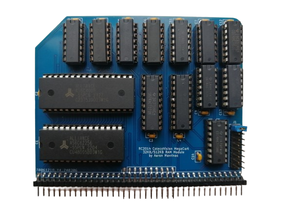

# RC2014 ColecoVision MegaCart 32KB/512KB RAM Module

This is a RAM module for [RC2014](https://rc2014.co.uk/) computers designed to provide bank-switching compatible with Opcode Games' [MegaCart](https://forums.atariage.com/topic/216354-colecovision-megacart-faq/). With the provided loader, both ordinary ColecoVision ROMs and MegaCart ROMs up to 512KB can be run from memory.

## How It Works

The module is essentially a drop-in replacement for a standard [RC2014 64k RAM](https://rc2014.co.uk/modules/64k-ram/) module configured to use the full 64KB address space.

The lower 32KB works exactly as in the standard module, including the page pin.

Initially on power-up, the upper 32KB also works exactly as in the standard module. However, upper memory actually uses a 512KB RAM, which is divided into 32 16KB banks. Bank switching can be toggled for either the lower 16KB or the upper 16KB by writing to a register on a configurable I/O port. Writing a 0 or 1 in D0 or D1 disables or enables bank switching on the lower 16KB or the upper 16KB, respectively. In other words, 0 disables bank switching, 1 enables it for the lower 16KB, and 2 enables it for the upper 16KB. (It is technically possible to enable bank switching for both ranges, but they will then both point at the same bank.) Writing a 1 in D2, D3, or D4 forces A16, A17, or A18 high, respectively, allowing the bank mirroring to work as in the 64KB/128KB/256KB MegaCarts for compatibility with those ROMs.

The register values actually used by the loader program in this repository are:

| Value | Bank Switching Enabled | ROM Size |
|-------|------------------------|----------|
|    0  |           no           |    any   |
|    1  |       lower 16KB       |    any   |
|    2  |       upper 16KB       |   512KB  |
|   18  |       upper 16KB       |   256KB  |
|   26  |       upper 16KB       |   128KB  |
|   30  |       upper 16KB       |    64KB  |

With bank switching enabled for one of these ranges, any read from one of the upper 32 addresses in the range (BFE0-BFFF for the lower 16KB, FFE0-FFFF for the upper 16KB) will page in the corresponding bank. By default (i.e. with bank switching disabled), for compatibility with the MegaCart, with banks numbered from 0 to 31, the lower 16KB uses bank 31, and the upper 16KB uses bank 0.

On the ColecoVision MegaCart, bank switching is always enabled on the upper 16KB (bank 0 at boot), and the lower 16KB always points at bank 31. The additional functionality of this module allows it to be used as a normal 64KB of RAM (without strange effects from unwanted bank switching), and is also necessary to keep CP/M resident in upper memory while ROM files are read from disk and loaded into the other banks.

J1 configures the write-only register I/O port to one of, from top to bottom (A0 not decoded): 0E/0F, 2E/2F, 4E/4F, 6E/6F, 8E/8F, AE/AF, CE/CF, EE/EF.

## Bill of Materials

| Reference | Part                            |
|-----------|---------------------------------|
|     U1    | AS6C62256 32K x 8 SRAM          |
|     U2    | AS6C4008 512K x 8 SRAM          |
|   U3-U4   | 74HCT273 octal D-type flip-flop |
|   U5-U6   | 74HCT21 dual 4-input AND gate   |
|   U7-U8   | 74HCT08 quad AND gate           |
|   U9-U11  | 74HCT32 quad OR gate            |
|    U12    | 74HCT02 quad NOR gate           |
|    U13    | 74HCT04 hex inverter            |
|    U14    | 74HCT138 3-to-8 line decoder    |
|   C1-C14  | 0.1uF disc/MLCC capacitor       |
|     J1    | 2x8 straight pin header         |
|    BUS    | 2x40 right angle pin header     |

## Building a RC2014 ColecoVision

Your RC2014 will need several other modules and some specific configuration to run ColecoVision games.

### TMS9918 Video Card

The ColecoVision uses the [TMS9918 VDP](https://en.wikipedia.org/wiki/TMS9918) for graphics. J. B. Langston's [TMS9918A video card](https://github.com/jblang/TMS9918A) for the RC2014 can be configured to respond to the A0-BF address range and send its interrupt signal to NMI, for compatibility with unmodified ColecoVision software.

Unfortunately, although the standard RC2014 [Pageable ROM](https://rc2014.co.uk/modules/pageable-rom/) module canonically uses ports 30 and 38, it conflicts with the B0-BF range needed by the VDP. It is possible to [modify the module](https://github.com/jblang/TMS9918A/issues/12) to reduce the address range to 30-3F.

### SN76489 Sound Card

The ColecoVision uses the [SN76489](https://en.wikipedia.org/wiki/Texas_Instruments_SN76489) sound generator for music and sound effects. J. B. Langston's [SN76489 sound card](https://github.com/jblang/SN76489) for the RC2014 can be configured to respond to port FF, for compatibility with unmodified ColecoVision software.

### AY-3-8910/YM2149F Sound Card

Many modern ColecoVision releases depend on Opcode Games' [Super Game Module](https://www.colecovision.dk/sem.htm). In addition to expanded RAM, the SGM includes an AY-3-8910 sound generator for enhanced sound and music. Ed Brindley's [YM2149F sound card](https://github.com/electrified/rc2014-ym2149) for the RC2014 can be configured to use ports 50, 51, and 52 for register select, write, and read, respectively, for compatibility with unmodified ColecoVision SGM software.

### Controller Interface

J. B. Langston's [game controller interface](https://github.com/jblang/GameController) for the RC2014 works with original ColecoVision controllers (or compatible controllers), and works with unmodified ColecoVision software.

### Clock

The Z80 CPU in the ColecoVision is driven by a 3.579545 MHz main clock. Dividing Clock 1 by 2 on the standard [Dual Clock](https://rc2014.co.uk/modules/dual-clock-module/) module sets the main clock speed to 3.6864 MHz, which is fairly close and seems to work with most (all?) games. Alternatively, an actual 3.579545 MHz oscillator can be connected to the external clock interface.
